# SISO RPN Calculator

This project is a **Serial-In Serial-Out (SISO)** calculator made in **VHDL** and was created as part of the course *System-on-Chip for Embedded Systems* course at the University of Twente.

The design implements a **Reverse-Polish Notation (RPN)** calculator using integer arithmetic.  
For more information about RPN, see [this page on the HP Museum website](https://www.hpmuseum.org/rpn.htm).

The system is built from several main modules:
- **Fetch** – reads ASCII input and converts it into tokens (numbers or operators).  
- **ALU** – performs arithmetic operations.  
- **Stack** – stores operands and intermediate results.  
- **Top** – connects and manages all modules.  

A **Test Vector Controller (TVC)** is used to provide ASCII input to the calculator and verify the output, simulating user input step by step.

Supported operations are limited to:
- Addition (`+`)  
- Subtraction (`-`)  
- Multiplication (`*`)

### Functionality

The calculator takes as input a string of ASCII characters representing an equation written in **Reverse Polish Notation (RPN)**. 

Each character is processed one by one. Digits are combined into full numbers, which are then pushed onto a stack.  
When an operator is received, the calculator pops the required operands from the stack, performs the operation, and pushes the result back.  

---

### Top-Level Design

The top-level design of the calculator connects all main blocks and controls their operation using a **finite state machine (FSM)**.  
Table below lists all top-level signals:

| Name       | Direction | Width                |
|-------------|------------|----------------------|
| `clk`       | input     | [0:0]                |
| `rst`       | input     | [0:0]                |
| `data_in`   | input     | [6:0] (ASCII input)  |
| `req`       | output    | [0:0]                |
| `ready`     | output    | [0:0]                |
| `data_out`  | output    | [word_length-1:0]    |

The design uses one generic parameter:  
- `word_length` – sets the data width for calculations and outputs.

The architecture is shown in the figure below:

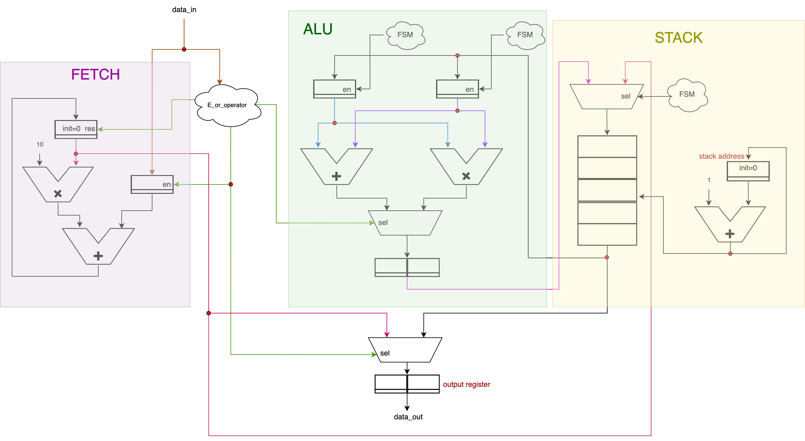

At the top level, these blocks are connected and controlled by the **main FSM**, which coordinates number building, pushing, popping, and operations.  
The FSM graph is shown below:

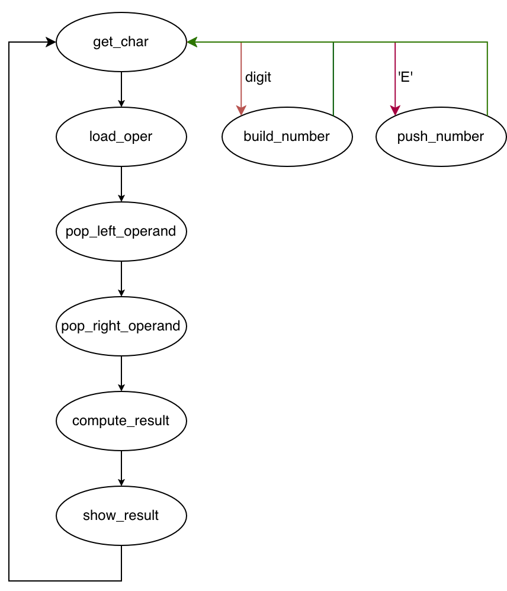

The calculator accepts **7-bit ASCII input**, which is enough to represent all required characters.  
The output width is defined by the generic `word_length`.

---

### Fetch Block

The **Fetch** block reads ASCII input characters, builds decimal numbers, and generates control signals when it detects the character `E` (Enter) or an operator (`+`, `-`, `*`).

| Name            | Direction | Width               |
|-----------------|------------|---------------------|
| `clk`           | input     | [0:0]               |
| `reset`         | input     | [0:0]               |
| `data_in`       | input     | [6:0]               |
| `number_out`    | output    | [word_length-1:0]   |
| `is_e_o`        | output    | [0:0]               |
| `is_digit_o`    | output    | [0:0]               |
| `is_operator_o` | output    | [0:0]               |

The block checks if the ASCII code is within the range `[48, 57]`, which represents digits `'0'`–`'9'`.  
If the input is a digit, it performs the computation:
number_next = number * 10 + (x - 48)

If the character is `'E'`, it raises `is_e_o`.  
If it detects an operator, it raises `is_operator_o`.  
For each digit, it asserts `is_digit_o`.

We considered reusing the ALU for ASCII-to-decimal conversion, but this would significantly reduce performance.  
Our dedicated conversion hardware completes the process in **N clock cycles for an N-digit number**, whereas the ALU-based method would require roughly four times as many cycles.

---

### ALU

| Name       | Direction | Width               |
|-------------|------------|---------------------|
| `clk`       | input     | [0:0]               |
| `reset`     | input     | [0:0]               |
| `en`        | input     | [0:0]               |
| `data_in`   | input     | [word_length-1:0]   |
| `data_out`  | output    | [word_length-1:0]   |
| `ready`     | output    | [0:0]               |

The ALU is based on the design from the POW project, modified to support **addition**, **subtraction**, and **multiplication**.  
We replaced the NUL operation with subtraction and added an **enable signal** to start the FSM only when a calculation request arrives.

Two shared registers are used for all operations. This approach introduces some internal switching, which slightly increases power usage but **reduces total area**.  
Subtraction is implemented using the adder by inverting the second operand, giving both **area** and **power** savings.

---

### Stack

| Name          | Direction | Width               |
|----------------|------------|---------------------|
| `clk`          | input     | [0:0]               |
| `reset`        | input     | [0:0]               |
| `data_in`      | input     | [word_length-1:0]   |
| `stack_push`   | input     | [0:0]               |
| `stack_pop`    | input     | [0:0]               |
| `overflow`     | output    | [0:0]               |
| `underflow`    | output    | [0:0]               |
| `empty_out`    | output    | [0:0]               |
| `top`          | output    | [word_length-1:0]   |

The **Stack** has two generics:
- `word_length` – bit width of stored words  
- `max_height` – stack capacity  

It is implemented as an array with separate read and write pointers.  
When `push` is triggered and the stack is not full, the input value is written to memory, and the write pointer increments.  
When `pop` is triggered, the write pointer decrements.  

Overflow occurs when a push happens while the stack is full, and underflow occurs when a pop is requested while the stack is empty.

Since the calculator only supports **binary operations** (two operands), the top-level stack capacity is set to **2** for minimal area.  
Because `max_height` is generic, it can be easily increased if needed.

---

## How It Works

The TVC reads the file `data_in.in`, where each line represents one complete RPN expression to be calculated.  
When the DUT requests input (`req='1'`), the TVC sends the next valid ASCII character from the line through `data_in`.  
Only calculator-relevant characters are sent — digits (`0--9`), the enter key (`E`), and operators (`+`, `-`, `*`).  
Any spaces, tabs, or comments (starting with `#`) are ignored and never sent to the DUT.

After sending all characters from one line, the TVC resets both itself and the DUT before starting the next line.  
This ensures that every test runs independently and starts from a clean state.

What makes this TVC special is that it is not just an input generator, but effectively a RPN calculator on its own.  
It interprets each RPN expression, maintains an internal stack, and performs all operations in parallel with the DUT.  
By doing so, it continuously predicts what the DUT should output at every operator, turning the verification process into a live comparison between two calculators: the DUT hardware implementation and the TVC’s internal software model.  
This design makes the testbench fully self-checking, highly reliable, and capable of validating complex arithmetic expressions without any manual supervision.

---

## Self-Checking and Reference Model

To verify the DUT’s correctness, the TVC includes its own built-in reference model that behaves like a real RPN calculator.  
It keeps an internal stack, combines digits into numbers, and executes each operation as soon as an operator appears.  
Whenever the model performs an operation, it saves the expected result for comparison.  
When the DUT signals that a result is ready (`ready='1'`), the TVC checks whether the DUT’s output matches what the model calculated.  
If they match, the test continues silently; if not, the TVC reports a mismatch but allows the simulation to go on.  
The TVC also catches unusual situations, such as when the DUT produces an output before the model expects one, helping to detect timing or control issues early.

---

## Reset Handling

The DUT produces a zero value on `data_out` right after reset. If this initial value were compared directly, it would be seen as an error, since this is not something the TVC computes. However, since this is a very normal behavior that the DUT has to show, we needed to handle this and prevent false mismatches. So, the TVC uses a simple *priming mechanism*.  
This mechanism waits until the reference model has generated the first valid expected result before starting any comparisons.  
Only from that point onward are the DUT outputs checked, ensuring that any zeros produced right after reset are correctly ignored.

---

## Input File and Parsing

The TVC reads all its test cases from the file `data_in.in`.  
Each line in this file represents one complete RPN expression, which is treated as a separate calculator run.  
Spaces and tabs can be used freely to improve readability, and they are simply ignored by the TVC.  
Comments can also be added by starting a line or a section of it with the `#` character — everything after that is skipped.  
After finishing one line, the TVC resets both the DUT and its internal model before moving on to the next one.  
This makes it easy to organize multiple test cases in a single file and simulate them all automatically in one go.

---

## Logging and Reporting

All results produced by the DUT while `ready='1'` are written to the file `data_out.out`.  
Each input stream’s outputs are separated by a clear divider line (`#------------------`) so that every test run can be identified easily.  
At the same time, the TVC prints a short summary to the simulator console for each stream, including:
- the number of characters sent to the DUT,
- the number of valid outputs received,
- and the number of mismatches or warnings detected.

If the DUT becomes inactive for too long (that is, neither `req` nor `ready` change for several cycles),  
a small watchdog inside the TVC automatically issues a warning and skips to the next test case.  
This prevents the simulation from hanging and ensures that all remaining streams are still processed.

---

## Verification Strategy

To verify that the RPN calculator behaves correctly under all conditions, a series of carefully selected input streams were created.  
These streams cover both normal and corner-case scenarios.  
The goal was to check not only arithmetic correctness but also robustness against invalid inputs, handling of zeros, and overflow behavior.  
An overview of the test cases and their purposes is shown in the table below.

| **Input Stream** | **Expected Result(s)** | **Purpose / Description** |
|------------------|------------------------|----------------------------|
| `35E2*123+` | 70, 193 | Example from assignment; verifies correct order of operations (multiplication before addition). |
| `10E10*10*10*` | 100, 1000, 10000 | Tests repeated multiplication and stack reuse. |
| `007E045-` | -38 | Verifies that leading zeros are ignored when entering numbers. |
| `-*+7E4-` | 0, 0, 0, 3 | Ensures invalid or random operators at the start are ignored and normal operation resumes when valid data arrives. |
| `+*-++-` | 0, 0, 0, 0, 0, 0 | Contains only invalid input; DUT should safely ignore all presses and produce no output. |
| `20E50-3*12+` | -30, -90, -78 | Uses all three operations in a single expression: subtraction, multiplication, and addition. |
| `5E` | 0 | Tests case where a single number is pushed and no operation follows; output remains stable. |
| `5E0+` | 5 | Addition involving zero. |
| `0E5+` | 5 | Addition involving zero (reverse order). |
| `5E0*` | 0 | Multiplication with zero as the second operand. |
| `0E5*` | 0 | Multiplication with zero as the first operand. |
| `5E0-` | 5 | Subtraction where zero is subtracted from a positive number. |
| `0E5-` | -5 | Subtraction where a smaller value (0) is subtracted from a larger one (5). |
| `2000E30*` | -5536 | Tests overflow behavior. The true result of 2000 × 30 = 60000 exceeds the 16-bit signed range. In two’s complement arithmetic, the value wraps around modulo 2^16, yielding 60000 - 65536 = -5536, which matches the DUT output. |

---

## TVC Simulation Transcript

The figure below shows the simulator transcript produced by the TVC during the simulation.  
This log confirms that all input streams were processed successfully, with no functional mismatches except for the intentional overflow case.  
In that case, the TVC expected a value of 60000, but the DUT correctly produced -5536 due to 16-bit signed overflow.  
Two other streams include warning messages related to invalid or random operator sequences (`-*+7E4-` and `+*-++-`); as expected, the simulation continues without interruption, demonstrating that the TVC handles such cases correctly.

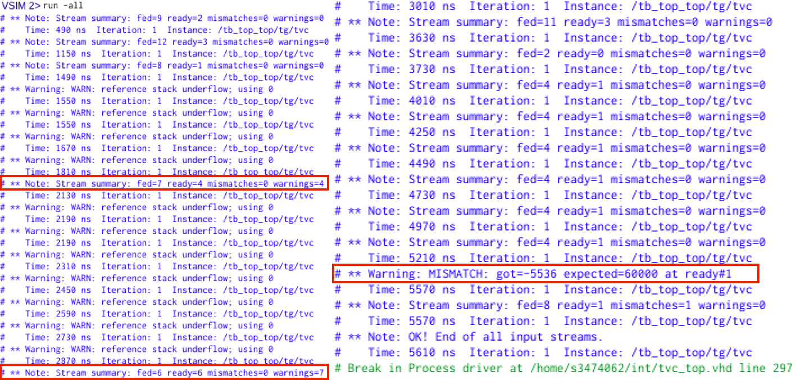

---

## A Summary of Key Features

- **Self-checking design:** the TVC includes its own calculator model that predicts the correct results and compares them directly with the DUT output.  
- **Readable input format:** supports multi-line input files with spaces and comments, making test cases easy to write and understand.  
- **Automatic reset handling:** each test run starts from a clean state, ensuring full independence between test cases.  
- **Live result comparison:** mismatches and timing issues are detected immediately and reported without stopping the simulation.  
- **Robustness:** safely ignores invalid inputs, leading zeros, and initial zeros after reset.  
- **Overflow awareness:** correctly handles and reports 16-bit signed overflow behavior.  
- **Comprehensive reporting:** provides both console summaries and detailed log files for post-simulation analysis.

The functionality of the RPN calculator was first verified through pre-synthesis.  
These simulations confirm that the DUT correctly performs arithmetic operations, manages the stack, and communicates properly with the TVC.  
Five representative test cases were selected to demonstrate correct handling of normal operations, invalid inputs, and overflow conditions.

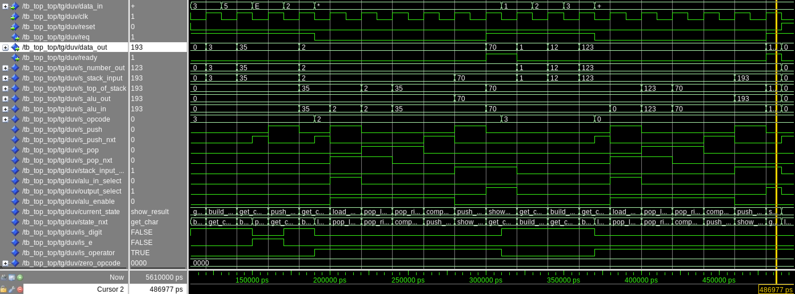

*Figure: `35E2*123+` – example taken from the assignment page.*

---

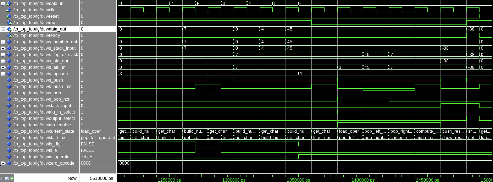

*Figure: `007E045-` – confirms proper subtraction and that leading zeros do not affect results.*

---

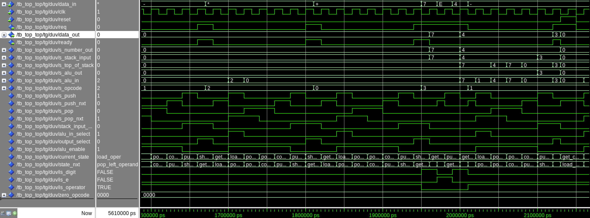

*Figure: `-*+7E4-` – tests robustness by ignoring invalid leading operators and continuing normal operation.*

---

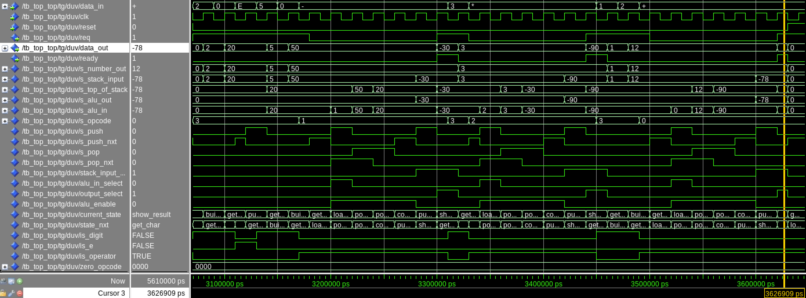

*Figure: `20E50-3*12+` – uses all three operators in one expression, checking full ALU functionality.*

---

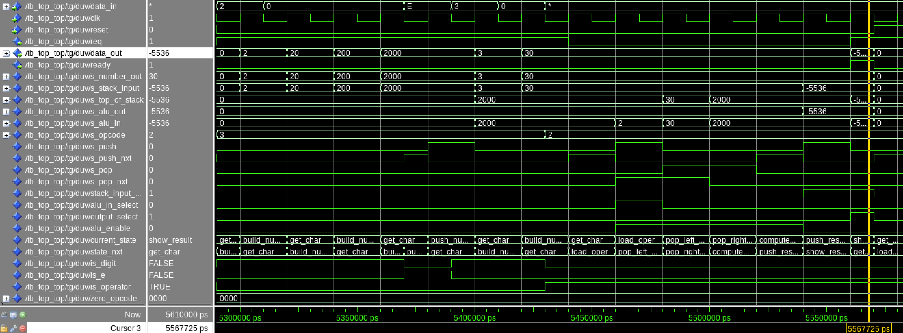

*Figure: `2000E30*` – demonstrates correct overflow behavior in 16-bit signed arithmetic.  
The result wraps around from 60000 to -5536, matching two’s complement arithmetic.*

## Area Report

The total cell area of the design is **30,967.4 µm²**.  
Table below shows the contribution of each submodule.

| **Module** | **Area (µm²)** | **Percentage of Total** |
|-------------|----------------|--------------------------|
| ALU (`alu_word_length16`) | 17,506.6 | 56.5% |
| Stack (`stack_word_length16_max_height3`) | 6,602.5 | 21.3% |
| Fetch Unit (`fetch_word_length16`) | 4,358.2 | 14.1% |
| Top-Level Logic and Misc. | 2,500.1 | 8.1% |
| **Total** | **30,967.4** | **100%** |

*Table: Area breakdown by design blocks.*

---

## Timing Report

The synthesis was performed for a clock period of **10 ns** (100 MHz target).  
The achieved worst-case timing slack was **+2.45 ns**, meaning the design easily meets the 10 ns requirement.

- **Clock period:** 10.00 ns  
- **Data arrival time:** 7.47 ns  
- **Data required time:** 9.92 ns  
- **Slack:** +2.45 ns *(timing met)*

Additional synthesis runs were performed for shorter clock periods, and the design continued to meet timing  
with positive slack values down to a period of **4 ns** (corresponding to 250 MHz operation).  
This confirms that the architecture is both compact and fast enough for real-time calculator operation.

As examples, the same set of RPN input streams as in the pre-synthesis stage are shown below to ensure a direct comparison.  
Figures below show the waveform results for the five representative test cases.

The post-synthesis results match the pre-synthesis simulations for all test cases, except for the first test case, where the output signals appeared as unknown during simulation.  
All other expressions produced the same results as in RTL, confirming a successful implementation.

---

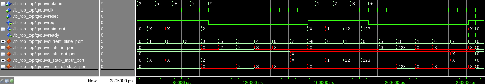

*Figure: `35E2*123+` – post-synthesis waveform. The output signals show unknown values during simulation.*

---

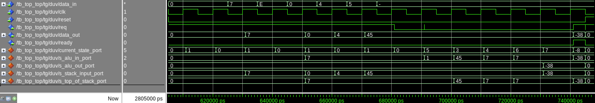

*Figure: `007E045-` – correct subtraction result observed, confirming consistent functional behavior after synthesis.*

---

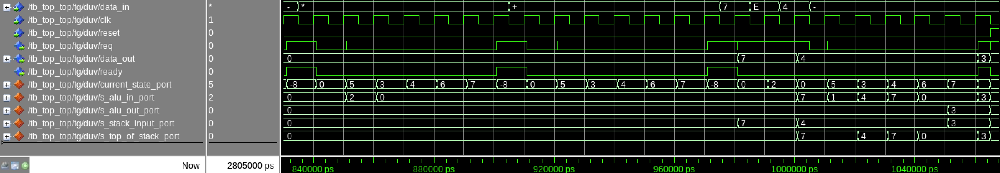

*Figure: `-*+7E4-` – invalid operators are ignored, and the calculator continues with normal operation.*

---

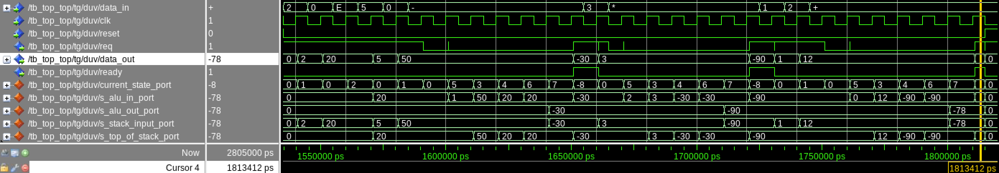

*Figure: `20E50-3*12+` – all three operators function correctly, showing consistent arithmetic execution at gate level.*

---

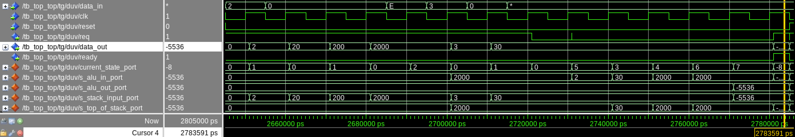

*Figure: `2000E30*` – overflow behavior remains identical to RTL simulation, producing -5536 as expected.*

Two versions of the design were analyzed: one with clock gating enabled and one without.  
Table below summarizes the results.

| **Metric** | **With Clock Gating** | **Without Clock Gating** |
|-------------|-----------------------|---------------------------|
| Leakage Power | 86.26 nW | 86.59 nW |
| Internal Power | 0.9500 mW | 1.3381 mW |
| Switching Power | 0.3027 mW | 0.0484 mW |
| **Total Power** | **1.2528 mW** | **1.3867 mW** |

*Table: Power comparison with and without clock gating.*

Clock gating leads to a small reduction in total dynamic power.

